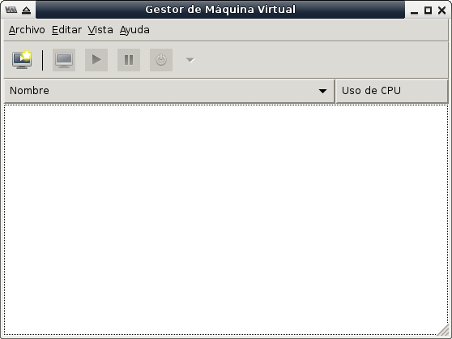
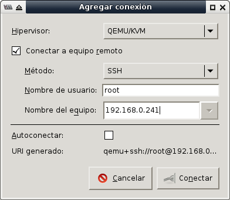
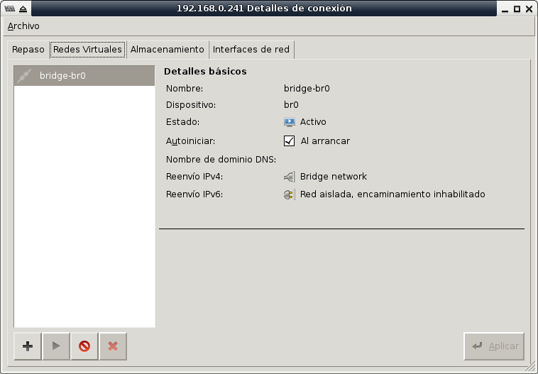

Instalación de CentOS para virtualizar
======================================

Corto: CentOS para virtualizar
Fecha: 2014-01-30 10:20
Categorías: CentOS, Virtualización

[CentOS](https://www.centos.org/) es una distribución GNU/Linux mantenida por la comunidad a partir del código libre de [Red Hat](https://www.redhat.com/). De una forma práctica, **CentOS** es lo mismo que **Red Hat** pero sin su marca comercial ni soporte técnico de paga. La estabilidad y confiabilidad de CentOS lo hacen la mejor opción para sistema operativo base de un servidor cuyo fin sea virtualizar. Recientemente se ha anunciado el apoyo directo de Red Hat a la comunidad de CentOS; de lo cual esperamos muchas ganancias para todos.

<!-- break -->

#### Objetivo

Instalar CentOS con lo mínimo necesario para virtualizar con KVM. Teniendo en mente que sólo va a llegar a Terminal, es decir, sin interfaz gráfica o _GUI_. La administración será vía **OpenSSH** y por el **Administrador de Virtualizaciones** desde otro equipo.

#### Requerimientos

* Una computadora o servidor con capacidad para virtualizar en hardware. Consulte el sitio del [KVM](http://www.linux-kvm.org/page/Main_Page) para saber más.
* Un mínimo de 2 GB de RAM.
* Disco duro dedicado de por lo menos 100 GB.
* Descargar y quemar el CD Minimal de [CentOS](https://www.centos.org/).

#### Arranque con el CD Minimal

Hay varios tipos de discos ISO de CentOS para cada versión. Desde DVD completos a CD para instarar por red. Su servidor recomienda usar el **CD Minimal x86_64** ya que contiene lo básico para llegar a una terminal. Considere que es poco útil y riesgoso tener una interfaz gráfica en un servidor.

Durante la instalación elija estas opciones:

* GRUB: Install or Update
* Idioma: Spanish
* Teclado: Latinoamericano
* Special Storage Devices
* Use All Space

Ya que haga su primer arranque, a partir de lo instalado en el disco duro, continúe con los siguientes pasos.

#### Levante la red

Por defecto no levanta ningún dispositivo de red. Como partimos del **CD Minimal** necesitaremos salida a internet para bajar el software. Para configurar el dispositivo de red **eth0** edite:

    # cd /etc/sysconfig/network-scripts
    # vi ifcfg-eth0

Si quiere usar una **dirección IP fija**, por ejemplo 192.168.0.250 con ruteador 192.168.0.254 (conserve el **HWADDR**):

    DEVICE=eth0
    HWADDR=xx:xx:xx:xx:xx:xx
    TYPE=Ethernet
    ONBOOT=yes
    NM_CONTROLLED=no
    IPADDR=192.168.0.250
    NETMASK=255.255.255.0
    GATEWAY=192.168.0.254

Luego debe configurar cuáles serán sus servidores DNS:

    vi /etc/resolv.conf

Escriba el dominio si lo usa, luego cada servidor DNS como una línea _nameserver_. En el siguiente ejemplo se usa un dominio _oficina.lan_ y las direcciones IP de los [DNS de Google](https://developers.google.com/speed/public-dns/?hl=es-):

    domain oficina.lan
    search oficina.lan
    nameserver 8.8.8.8
    nameserver 8.8.4.4

En cambio, para solicitar una **dirección IP dinámica** al servidor DHCP se usa **BOOTPROTO**:

    DEVICE=eth0
    HWADDR=xx:xx:xx:xx:xx:xx
    TYPE=Ethernet
    ONBOOT=yes
    NM_CONTROLLED=no
    BOOTPROTO=dhcp

Después de cambiar estos archivos de configuración, reinicie el servicio de red para hacerlos efectivos.

    # service network restart

Revise la dirección IP obtenida con:

    # ifconfig eth0

Revise la tabla de ruteo también:

    # route -n

#### Configure proxy de ser necesario

En caso de tener internet a través de un _proxy_ debe de editar el archivo de configuración de **Yum**:

    # vi /etc/yum.conf

Agregue una línea como la siguiente para definir el servidor _proxy_. Cambie _proxy.oficina.lan_ por el nombre o dirección IP del _proxy_.

    proxy=http://proxy.oficina.lan:3128

#### Actualize e instale el software para virtualizar

Ejecute estos dos comandos para actualizar las listas de los repositorios de CentOS:

    # yum check-update
    # yum update

Por ser programas indispensables, instale **nano**, **sudo** y **man**:

    # yum install nano sudo man

Yum ofrece la instalación por **grupos**, éstos son conjuntos de paquetes de software. Para listar los **grupos** ejecute este comando:

    # yum grouplist

Instale los **grupos** de paquetes que tienen que ver con virtualización en servidor:

    # yum groupinstall "Virtualización"
    # yum groupinstall "Plataforma de virtualización"
    # yum install tunctl

Esta descarga es grande y puede demorar algo de tiempo, dependiendo de su velocidad de internet. Al terminar de instalar reinicie el servidor para asegurar que las actualizaciones y el nuevo software estén trabajando. Reinicie con:

    # shutdown -r 1 &
    # exit

#### Configuración del bridge

Cree el archivo **ifcfg-br0** con la configuración para el _bridge_:

    # cd /etc/sysconfig/network-scripts/
    # nano ifcfg-br0

Si **br0** va a tener una dirección IP estática, use lo siguiente como contenido del archivo **ifcfg-br0** ajustando la dirección IP, la máscara y el _gateway_ a sus necesidades:

    DEVICE=br0
    TYPE=Bridge
    ONBOOT=yes
    DELAY=0
    NM_CONTROLLED=no
    IPADDR=192.168.0.250
    NETMASK=255.255.255.0
    GATEWAY=192.168.0.254

Luego, hay que editar el archivo **ifcfg-eth0** para indicar que ese dispositivo de red se va conectar al _bridge_:

    # nano ifcfg-eth0

Con este contenido:

    DEVICE="eth0"
    HWADDR="xx:xx:xx:xx:xx:xx"
    NM_CONTROLLED="no"
    ONBOOT="yes"
    BRIDGE="br0"

#### Configure el muro de fuego

Para que se permitan todas las comunicaciones que fluyan a través del _bridge_ **br0** es necesario indicarlo. Edite la configuración del muro de fuego:

    # cd /etc/sysconfig/
    # nano iptables

Agregue la línea **-A FORWARD -i br0 -j ACCEPT** como la primer línea con _FORWARD_, por ejemplo:

    *filter
    :INPUT ACCEPT [0:0]
    :FORWARD ACCEPT [0:0]
    :OUTPUT ACCEPT [0:0]
    -A INPUT -m state --state ESTABLISHED,RELATED -j ACCEPT
    -A INPUT -p icmp -j ACCEPT
    -A INPUT -i lo -j ACCEPT
    -A INPUT -m state --state NEW -m tcp -p tcp --dport 22 -j ACCEPT
    -A INPUT -j REJECT --reject-with icmp-host-prohibited
    -A FORWARD -i br0 -j ACCEPT
    -A FORWARD -j REJECT --reject-with icmp-host-prohibited
    COMMIT

Reinicie el muro de fuego

    # service iptables restart

Verifique...

    # iptables -L -v -n

#### Destruir el puente virbr0

Como se va a levantar el _bridge_ **br0** desde el sistema operativo, sale sobrando el puente que por defecto habilita **libvirt**. Para observar que esta presente **virtbr0** ejecute:

    # ifconfig

Notará que hay un dispositivo **virbr0** con una dirección IP indpenediente (p.e. 192.168.122.1). El comando **virsh net-list** mostrará las redes para las virtualizaciones:

    # virsh net-list
    Nombre               Estado     Inicio automático Persistente
    --------------------------------------------------
    default              activo     si            si

Para destruir la red **default** ejecute:

    # virsh net-destroy default
    # virsh net-undefine default

Revise:

    # virsh net-list
    # ifconfig

#### Reinicie el servidor

Para asegurar que las actualizaciones y configuraciones inicien al encender, reinicie el servidor.

    # shutdown -r 1 &
    # exit

Y revise que los dispositivos de red y los servicios estén trabajando como debe.

    # ifconfig br0
    # ifconfig eth0
    # brctl show

#### Configurar libvirt para que use br0

Para que las virtualizaciones usen el _bridge_ del sistema operativo, cree un archivo de configuración **xml**. Use el nombre de archivo que guste:

    # cd /root
    # nano bridge-br0.xml

Escriba el siguiente contenido, cambiando **bridge-br0** por el nombre que usted prefiera:

    <network>
      <name>bridge-br0</name>
      <forward mode="bridge"/>
      <bridge name="br0"/>
    </network>

Para cargar ese archivo **xml** en **libvirt** ejecute...

    # virsh net-define bridge-br0.xml
    La red bridge-br0 se encuentra definida desde bridge-br0.xml

**Atención:** En este momento, el comando **# virsh net-list** NO mostrará esta red. En cambio, con el parámetro **--all** sí lo verá:

    # virsh net-list --all
    Nombre               Estado     Inicio automático
    -----------------------------------------
    bridge-br0           activo     no

Puede solicitar información detallada de una red con el comando **virsh net-info** seguido por el nombre de la red.

    # virsh net-info bridge-br0
    Nombre          bridge-br0
    UUID            xxxxxxxx-xxxx-xxxx-xxxx-xxxxxxxxxxxx
    Activar:        no
    Persistente:    si
    Autoinicio:     no
    Puente:         br0

Observe que Activar y Autoinicio están en **no**. Configure que esta red se habilite al inicio, con:

    # virsh net-autostart bridge-br0
    La red bridge-br0-dgspm ha sido marcada para iniciarse automáticamente

Luego, arranque esta red con:

    # virsh net-start bridge-br0
    La red bridge-br0 se ha iniciado

Verifique que Activar, Persistente y Autoinicio estén en **si**:

    # virsh net-info bridge-br0
    Nombre          bridge-br0
    UUID            xxxxxxxx-xxxx-xxxx-xxxx-xxxxxxxxxxxx
    Activar:        si
    Persistente:    si
    Autoinicio:     si
    Puente:         br0

También con el comando **virsh net-list**:

    # virsh net-list
    Nombre               Estado     Inicio automático Persistente
    --------------------------------------------------
    bridge-br0           activo     si            si

En dado caso de que necesite recuperar la información de la red en formato **xml**, use el comando **virsh net-dumpxml**:

    # virsh net-dumpxml bridge-br0
    <network>
      <name>bridge-br0</name>
      <uuid>xxxxxxxx-xxxx-xxxx-xxxx-xxxxxxxxxxxx</uuid>
      <forward mode='bridge'/>
      <bridge name='br0' />
    </network>

#### Agregue un usuario común

Como en todo equipo de escritorio o servidor, es ampliamente recomendable dar de alta un usuario común y no usar root para todo. Para dar de alta un usuario ejecute el comando **useradd** con los grupos a los que necesite pertenecer y cambie _minombre_ por su nombre para ingresar.

    # useradd -g users -G tty,lp,wheel,uucp,games,video,audio,cdrom,kvm,qemu -m minombre

Establezca la contraseña:

    # passwd minombre

#### Administrador de virtualizaciones

Desde un equipo con interfaz gráfica y el **VirtManager** instalado administramos las virtaliuzaciones.

Establezca la conexión vía OpenSSH. Le solicitará la contraseña _root_:

Verifique que en los detalles se use la configuración de red con el _bridge_ **br0**:

