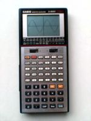

Calculadoras Científicas Chinas
===============================

Autor: guivaloz
Fecha: 2007-07-28 23:50
Categorías: Vida cotidiana

Es bien sabido que la industria china ha estado creciendo a pasos agigantados en los últimos años. Una de las estrategias para lograrlo es la fabricación de los productos exitosos, similares a los originales, pero a un precio muy bajo. Nos hemos encontrado con copias de casi todo, una de ellas salió en televisión abierta y fué muy comentada: réplicas de la Virgen de Guadalupe con razgos orientales.

Su servidor quedó sorprendido al encontrar en [Waldos](http://www.waldos.com/) (establecimento que dice vender todo a un sólo precio) un producto de particular aprecio, a un costo y en tal cantidad que nunca me la hubiera imaginado: *calculadoras científicas* _sin marca_ a *$11.50* más I.V.A.

<!-- break -->

¡Que barbaridad! ¡A lo que han llegado! Pues no me quedé con las ganas, y nomás por curiosidad me compré una y un par de pilas "AA" (que por cierto, también costaron $11.50 más I.V.A. en la misma tienda).

Debo de aclarar el por qué de mi aprecio por dicho aparato. Mis estudios de licenciatura son de Ingeniero Mecánico Administrador, y fui parte de una generación que ya no usaba la *regla de cálculo* (mis hermanos que me llevan más de 15 años sí la usuaron) pero al mismo tiempo, la computadora más común era la IBM PC, no usábamos como hoy poderosas computadoras portátiles, _Palm_ o similares. Nuestra mejor _arma_ fue la *calculadora científica*.

Las calculadoras que usé aún las conservo y siguen funcionando. Me costaron cada una un _huevo_ (y debí de haberme quedado _estéril_ después de comprar la segunda). Pero me ayudaron muchísimo en los pesadísimos cálculos y exámenes. Son las calculadoras Casio [fx-8000G](http://www.rskey.org/detail.asp?manufacturer=Casio&model=fx-8000G) y [fx-7500G](http://www.rskey.org/detail.asp?manufacturer=Casio&model=fx-7500G)

De regreso al _presente_, llegando a casa desempaqué la calculadora científica china. *No trae manual*, las únicas instrucciones están al reverso del empaque, dicen cómo introducir las pilas y cómo encenderla; _solamente_.

[Calculadora china encendidad](calculadoras-cientificas-chinas/encendida-small.jpg)

Los cálculos que he hecho han dado respuestas correctas. Tiene las típicas funciones trigonométricas, soporta grados, radianes y gradientes, logaritmos, paréntesis, estadística, números en binario, octal, hexadecimal y decimal (por supuesto), etc. Eso sí, como es de esperarse con cualquier producto barato, los botones son duros y los plásticos parecen frágiles. Y como mencioné antes, no trae manual.

En conclusión sí es una _buena_ calculadora científica a un precio más que accesible. Si valoramos el cúmulo de conocimiento que involucra el aparato, más la infinita cantidad de aplicaciones de nuestros cálculos a la hora de elaborar una tarea, proyecto u obra; es fantástico. Imagínense que hubiera pensado [Leonardo Da Vinci](http://en.wikipedia.org/wiki/Leonardo_da_vinci) si simplemente alguien del futuro le dijera que las calculadoras científicas son tan baratas como una botella de agua.

P.D. Espero algún día ver en los pasillos de [Waldos](http://www.waldos.com) y de otras tiendas, discos compactos de [Ubuntu](http://www.ubuntu.com) a $11.50 más I.V.A. No creo que falte mucho :D
