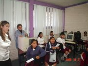

Conferencia "Software Libre" en la XV Semana de Ciencia y Tecnología
====================================================================

Corto: XV Semana Ciencia y Tec.
Fecha: 2008-10-26 08:30
Categorías: Conferencias

  

El pasado 21 de octubre de 2008, impartí la plática [Introducción al Software Libre](../presentaciones/software-libre.html) ante alumnos de 5to. y 6to. de primaria. Los niños de esta generación muestran un mayor uso de las herramientas informáticas que las generaciones pasadas; sin embargo, para ellos fue la primera vez que escucharon hablar sobre **Linux** y **Software Libre**.

Su servidor, les explicó las cualidades del Software Libre, su filosofía y la gran fuente de conocimiento y aprendizaje que representa. Para entender la importancia del _conocimiento libre_, hicimos comparaciones simples, como el qué hubiera sido de los descubrimientos de [Issac Newton](http://es.wikipedia.org/wiki/Isaac_Newton) si los hubiese patentado o si hubiera cobrado por hacer copias impresas de sus famosas [leyes de la dinámica](http://es.wikipedia.org/wiki/Leyes_de_Newton).

Para este público tan especial me fueron muy valiosas las animaciones de [Guadalinex](http://www.guadalinex.org/) que con sus [cortos animados](http://www.guadalinex.org/noticias/noticias/video-guadalinex-trae-de-todo) nos ayudan a fácilmente entender la misión del Software Libre. Además cada alumno se llevó una copia de [Ubuntu](http://www.ubuntu.com/) y la mayoría el _add-on_ para volverlo [Edubuntu](http://edubuntu.org/).

Agradezco al [Consejo Estatal de Ciencia y Tecnología (COECYT)](http://www.coecyt-coah.gob.mx/) su amable invitación a este evento educativo.
