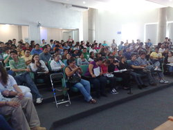
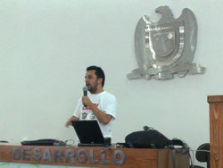
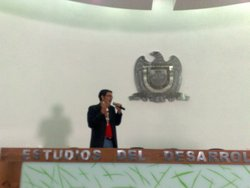
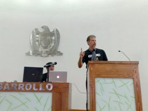
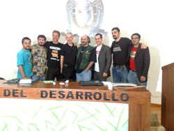

FOSS 2.0 - Reseña
=================

Fecha: 2011-06-14 10:17
Categorías: Conferencias

 

Los días 1 y 2 de junio de 2011 fue el [Segundo Congreso Internacional de Software Libre](http://www.estudiosdeldesarrollo.net/floss2) organizado por la [Universidad Autónoma de Zacatecas](http://www.uaz.edu.mx/). A modo de reseña les muestro fotografías y fragmentos de las ponencias.

<!-- break -->

#### Richard M. Stallman > El Movimiento del Software Libre y el Sistema Operativo GNU/Linux

_Hay que considerar cualquier programa privativo como posible malware._

**Todo el gobierno debe usar software libre**, porque si no lo hacen estarán dejando su control en otras manos, dañarán su soberanía informática y estará su seguridad en riesgo. Si el gobierno usa software libre promoverá la creación de empresas locales que le presten servicio en ese rubro.

**En la educación, todas las escuelas deben enseñar únicamente software libre.** La razón económica es simple, las escuelas en lo general no tienen muchos recursos y sería mejor gastarlos en más y mejores instalaciones que en software. Los jóvenes programadores tienen mayores oportunidades de aprendizaje con software libre que con software privativo. Por último, la razón moral, la educación debe fomentar buenos valores ciudadanos, el espíritu de buena voluntad y de cooperación.

_Alumno, si traes un programa a la clase, debes compartirlo. Usando software libre en la escuela._

Respecto a las empresas fabricantes de software privativo que regalan (o abaratan) su software en las escuelas, dice que es como la droga... _la primera dosis es gratis_.

#### Offray Vladimir Luna Cárdenas > Nómadas digitales, libre cultura y aprendizaje

[Offray](http://identi.ca/offray) habló sobre la **teoría de comunidades de práctica**, donde el aprendizaje es mejor y más rápido al formar parte de una comunidad. Por ejemplo, cuando jugamos fút-bol con los vecinos estamos aprendiendo de nuestros compañeros; lo cual es completamente distinto del esquema tradicional maestro-alumnos, que es unidireccional.

El gran reto es llevar esta forma de aprendizaje a los medios informáticos; con listas de correo, repositorios de archivos, redes sociales, _microwikis_ y _microblogs_. Donde ha aplicado la **Arquitectura Reconfigurable**.

_Estamos ante la posiblidad de cambiar las cosas que nos cambian._

En la **Arquitectura Reconfigurable** se buscan crear modelos *minimalistas* (pocas partes conectadas de manera poderosa), **extensibles** (que puedas cambiar desde fuera, como _plug-ins_), **emergentes** (complejidad que surge de lo simple) y con **memoria** (la tenemos que desenfatizar, no memorizar).

#### Rubén Rodríguez > Introducción a la distribución libre Trisquel GNU/Linux

Sólo nueve distribuciones son completamente libres; una de ellas es [Trisquel GNU/Linux](http://trisquel.info/). Nace en 2004, en un inicio como un derivado de [Debian](http://www.debian.org/).

Hoy en día la distribución tiene sus propios repositorios. Donde de 100 mil paquetes se han retirado 5 mil por no ser _completamente libres_ y otros 5 mil han sido modificados. _En total se alojan 300 gigabytes de software, lo cual es un trabajo enorme._

_La obligación de los profesores, como formadores de hombres y mujeres, es cambiar al software libre, deben enseñar con software libre._

#### Jose E. Marchesi > El Proyecto GNU: software y comunidad

El **Proyecto GNU** opera desde 1984 y su objetivo central es desarrollar y mantener el **Sistema Operativo GNU**. En él hay en este momento 343 mantenedores y más de 1000 desarrolladores, donde _el que más trabajo hace, más responsabilidad adquiere._

Los mantenedores son los responsables de los proyectos GNU y sólo son nombrados por Richard M. Stallman. Eso sí, todos son voluntarios. Algunos proyectos críticos disponen de un _steering committee_ como lo son **gcc**, **gdb**, y **libc**.

_Los desarrolladores y programadores son la espina dorsal del proyecto._

Labor no menos importante, también trabajan en el Proyecto GNU webmasters y traductores. Más información en [Planet GNU](http://planet.gnu.org/).

#### Fernando Javier Magariños Lamas "Mancha" > Software libre para una sociedad libre

_Un gobierno que está bajo la mira de los gobernados tiene menos chance de ser corrupto_

_Mancha_ nos invita a participar en el proyecto de la creación de un portal de transparecia mantenido por ciudadanos. Esto parte del hecho de que la mayoría de los documentos en línea de los portales de transparecia del gobierno son archivos PDF que tienen la información desordenada o con _trucos_ que dificultan su conversión por medio de software _OCR_.

Además nos da _tres razones más_: primero, **no hay auditoría que sobre**; segundo, **el que sea elaborado por geeks** y, tercero, **es divertido trabajar con mucha información.**

_Ya no existe ninguna razón para que nuestra democracia sea representativa en lugar de directa_

#### Guillermo Valdés Lozano > Estudiando el Cablegate de Wikileaks con Software Libre

La historia de [Wikileaks](http://www.wikileaks.info/), sus protagonistas y la revelación del _Cablegate_ fueron el contenido político internacional de esta ponencia.

_Wikileaks ejerce, según Julian Assange, un periodismo científico; mientras que en los periódicos lees lo que el reportero escribió o en la televisión ves las imágenes editadas y la opinión del comentarista; en Wikileaks tienes acceso al documento original._

Su servidor, detalló los hechos que ocurrieron en México como consecuencia de la revelación de los _cables_ diplomáticos de la Embajada de los E.E.U.U. Que culminaron con la renuncia del Embajador Carlos Pascual a su cargo.

El _Cablegate_ puede descargarse vía _torrent_ como un archivo comprimido, que al desempacarse recrea los archivos HTML para levantar un espejo en Internet del mismo. **Ante la necesidad de hacer consultas en nuestros propios equipos (y no por medio de los buscadores en la web) creé un conjunto de programas** llamados **CableRuby** que han sido liberados con la **Licencia GPL versión 3**.

#### Maximino Gerardo Luna Estrada > El Software Libre: una alternativa viable para la administración pública

Qué es el Software Libre y las razones para usarlo fueron los temas de Max en su ponencia. Entre las cuales están las razones económicas, independencia tecnológica, control total de la información, confiabilidad, estabilidad y lograr la solución más rápida porque tenemos la libertad de conocer bien el Software Libre.

Se habló de los casos de éxito de uso de Software Libre en **Venezuela, Argentina, E.E.U.U., España, Brasil y México.**

**México tuvo en 2006 una única presencia del término Software Libre en el Decreto de Austeridad de ese mismo año.** La presente administración federal **no** dio continuidad a ésta.

_Si alguien está dispuesto a ceder algo de su libertad en aras de un poco de comodidad, no merce ninguna de las dos._ Benjamín Franklin.

#### José Masdeu > El DataCenter LIBRE en el Estado, un caso de éxito

José nos explicó con amplio detalle el hardware y software que _digitaliza_ el sistema judicial argentino. **Éste proporciona más de 30 servicios que han ahorrado mucho dinero a su gobierno; básicamente por dejar de usar papel (paperless), hacer más eficientes los procesos y por no gastar en software privativo.**

A la pregunta de que si los usuarios sabrían que usarían Software Libre antes de aprobar el proyecto, respondió: _No hice público el proyecto porque se hubiese ido al fracaso. No tienen percepción de lo que hay, simplemente lo soluciona._

Otra pregunta: _En lugar de usar una instalación personalizada, ¿No será mejor usar Red Hat?_, respondió: _No, porque Red Hat sólo dá soporte al software que proporciona; no cubren software que ellos no conocen y nosotros sí queremo"._

#### Corinto Meffe > Las reflexiones con los resultados de la experiencia brasileña del software público

El portal [Software Publico](http://www.softwarepuvlico.gob.br/) ha crecido de 36,000 usuarios en 2009 a **100,000 usuarios** al día de hoy. Y de 33 soluciones a **50**.

_El software es un derecho de la sociedad. La sociedad tiene el derecho de acceder al software público._

Corinto nos platicó de la anécdota de _Odo de Tours_, quien en el pasado construyó un puente y no cobró peaje para cruzar por éste. Notó que fué mayor el tráfico y mayor la cantidad de bienes materiales que transitaban por ahí; toda la comunidad se beneficiaba con el puente. A semejanza, al fomentar el Software Libre se aumenta su cantidad y calidad; para beneficio de todos los ciudadanos. Pero **el Software Libre no es algo material, en cambio, es una riqueza intangible**.

_¡Nosotros somos partes de esta revolución!_

 
