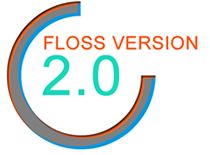

Segundo Congreso Internacional de Software Libre
================================================

Corto: FOSS 2.0
Fecha: 2011-05-27 11:20
Categorías: Conferencias

El [Segundo Congreso Internacional de Software Libre](http://www.estudiosdeldesarrollo.net/floss2) se llevará acabo los días 1 y 2 de junio del 2011, en la ciudad de Zacatecas, México. El marco del evento será el Auditorio de la [Unidad Académica en Estudios del Desarrollo](http://www.estudiosdeldesarrollo.net/) de la [Universidad Autónoma de Zacatecas](http://www.uaz.edu.mx/).

#### Software Libre y la U.A.Z.

La tendencia mundial y los casos de éxito en el uso de software libre por parte de empresas, universidades y gobiernos alrededor del mundo, advierten al menos un camino alterno a seguir en cuanto a la elección de la plataforma de software y, evidentemente, el software libre juega ya un papel muy importante. La plataforma académica parece ser el medio más indicado para la divulgación de este tipo de tecnología y, en el estado de Zacatecas la Unidad Académica en Estudios del Desarrollo de la UAZ ha venido promoviendo este movimiento mediante la elaboración de dos proyectos usando este tipo de software: El Sistema de Información sobre Migración y Desarrollo para el Estado de Zacatecas y El Sistema de Información Geográfico para el Estado de Zacatecas.

Dentro del quehacer de la Unidad Académica en Estudios del Desarrollo se encuentran el análisis, discusión, evaluación y la generación de insumos en diferentes campos del conocimiento, que contribuyan al desarrollo del estado de Zacatecas y del país con una perspectiva internacional. Es por ello que la difusión y divulgación de tecnologías de información que promuevan el desarrollo, como el software libre, resulta de gran importancia dentro del proyecto estratégico de la Unidad Académica en Estudios del Desarrollo.

#### Programa

Día 1, miércoles 1 de Junio.

* Richard Stallman, Free Software Foundation, USA; _El Movimiento del Software Libre y el Sistema Operativo GNU/Linux_
* Offray Vladimir Luna Cárdenas, Pontificia Universidad Javeriana, Colombia; _Nómadas digitales, libre cultura y aprendizaje_
* Rubén Rodríguez (Quidam), Director del Proyecto Trisquel GNU/Linux, España; _Introducción a la distribución libre Trisquel GNU/Linux_
* Jose E. Marchesi, Agencia Espacial Europea, Alemania; _El Proyecto GNU: software y comunidad_

Día 2, jueves 2 de Junio.

* Fernando Javier Magariños Lamas 'Mancha', Instituto de Geofísica de la UNAM, México; _Software libre para una sociedad libre_
* Guillermo Valdés Lozano, Grupo de Usuarios de GNU/Linux de la Laguna, México; _Estudiando el Cablegate de Wikileaks con Software Libre_
* Maximino Gerardo Luna Estrada, Unidad Académica en Estudios del Desarrollo, UAZ, México; _El software libre: una alternativa viable para la administración pública_
* José Masdeu, Jefe Centro de Datos, Investigacion y Desarrollo, Dirección General de Tecnología, Poder Judicial de la Nación, Argentina; _El DataCenter LIBRE en el Estado. Un caso de éxito_
* Corinto Meffe, Ministerio de Planeación, Presupuesto y Administración Gobierno de Brasil, Brasil. _Las reflexiones con los resultados de la experiencia brasileña del software público_

#### Dirección

Edificio de Doctorado en Estudios del Desarrollo, detrás de Biblioteca Central
Av. Preparatoria S/N, Col. Loma Dorada,
Apartado postal 3-138, C.P. 98065.
Zacatecas, Zac., México.

#### Más información en...

* [Segundo Congreso Internacional de Software Libre](http://www.estudiosdeldesarrollo.net/floss2)
* [Artículo publicado en La Prensa](http://www.oem.com.mx/laprensa/notas/n2078640.htm)
