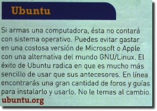
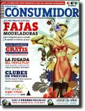
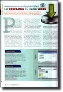
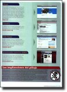

Revista del Consumidor - La descarga te hará libre
==================================================

Autor: guivaloz
Fecha: 2009-05-09 14:00
Categorías: Educación, GNU/Linux

Una muy grata sorpresa es encontrar un artículo dedicado al _software gratuito_ en una revista de circulación nacional. Es en la [Revista del Consumidor](http://revistadelconsumidor.gob.mx/) de Mayo de 2009. En la portada aparece como "Software Gratis que sí te ayuda a ahorrar (y no te convierte en pirata)".

Escrito por Sara Velázquez, habla a cerca de las desventajas de usar _software pirata_ y que la solución, en estos tiempos de crisis, es recurrir al software gratuito. Ella menciona: "Por lo regular, lo que es gratis suena a que es malo, o que será de menor calidad, pero no siempre es así. Por ejemplo, este artículo fue escrito utilizando OpenOffice 3.0, un paquete gratuito para oficina que no le pide nada al popular Office 2007."

<!-- break -->

Me gustó que se incluyera buenas recomendaciones con una amena explicación y el sitio web para su descarga. Muchas de estas recomendaciones son [Software Libre](http://es.wikipedia.org/wiki/Software_libre). Inclusive incluyeron a [Ubuntu](http://www.ubuntu.com/) como alternativa de reemplazo a MS Windows.

   

La Revista del Consumidor es un medio de la "Procuraduría Federal del Consumidor, PROFECO":http://www.profeco.gob.mx/ que tiene un tiraje de 45,000 ejemplares. El carácter informativo de la PROFECO se refleja en que la editorial añade la siguiente leyenda: "Está permitida la reproducción de los estudios de Laboratorio y/o análisis de precios en cualquier otro medio que apoye la intención de informar a grupos más amplios de la población." Por esto, me he tomado la libertad de digitalizar la portada y el artículo completo. Den _clic_ en las siguientes imágenes para leerlo.

    

Felicito a la PROFECO y a los editores de la [Revista del Consumidor](http://revistadelconsumidor.gob.mx/) por promover el Software Libre. Y no se pierdan este número; la revista está llena de consejos, recetas y análisis de precios muy interesantes.
