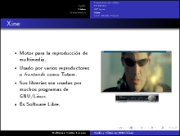

Audio y Video en GNU/Linux
==========================

Fecha: 2008-10-26 20:45
Categorías: GNU/Linux

  

Con motivo del *VI Simposium Nacional de Sistemas Computacionales e Informática (SINASCI)* organizado por el [Instituto Tecnológico Superior de Lerdo](http://www.itslerdo.edu.mx/) elaboré esta sencilla presentación para mostrar las cualidades de los programas multimedia LAME, Audacity, FFMPEG, MPlayer, Xine y VLC. Todos son Software Libre.

Descargar [Presentación](audio-y-video-en-gnu-linux/audio-y-video-en-gnu-linux.pdf) y [Fuentes LaTeX](audio-y-video-en-gnu-linux/audio-y-video-en-gnu-linux.tar.gz).
