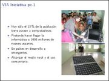

Consejos para una Informática Ecológica
=======================================

Corto: Informática Ecológica
Fecha: 2008-05-17 15:30
Categorías: GNU/Linux, Mini-ITX, Educación

  

Ante una nueva era donde hay más conciencia por la conservación del medio ambiente nos vemos en la necesidad de buscar mejores alternativas, más eficientes energéticamente hablando, de nuestros equipos informáticos. Las nuevas tecnologías del Kernel Linux, los fabricantes de equipos de cómputo y los usuarios debemos de hacer esfuerzos por lograr disminuir el consumo de energía en pro de nuestro mundo.

#### Descargar

* [Presentación](consejos-informatica-ecologica/consejos-informatica-ecologica.pdf)
* [Fuentes LaTeX](consejos-informatica-ecologica/consejos-informatica-ecologica.tar.gz).
