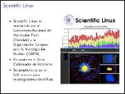

Distribuciones GNU/Linux, entornos y programas libres
=====================================================

Corto: Distribuciones GNU/Linux
Fecha: 2010-10-19 23:55
Categorías: GNU/Linux

  

Para el XX Semana Académica en la [Universidad Autónoma de Coahuila](http://www.uadec.mx/) su servidor elaboró esta amena y visual presentación sobre las distribuciones GNU/Linux y los entornos de escritorio más populares.

#### Descargar

* [Presentación 3.2 MB](distribuciones-gnulinux/distribuciones-gnulinux.pdf)
* [Fuentes LaTeX 6.2 MB](distribuciones-gnulinux/distribuciones-gnulinux.tar.gz).
