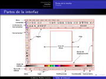

Taller de Inkscape
==================

Fecha: 2007-08-16 22:45
Categorías: Inkscape

  

Con motivo del aniversario del [Grupo de Usuarios de GNU/Linux de La Laguna](http://www.gulag.org.mx) participaré con un Taller de [Inkscape](http://www.inkscape.org). Esta es una presentación breve que explica lo que es el dibujo vectorial, las ventajas del Inkscape y muestra los ejercicios hechos.

#### Descargar

* [Presentación](inkscape-taller/inkscape-taller.pdf)
* [Fuentes LaTeX](inkscape-taller/inkscape-taller-latex.tar.gz)
