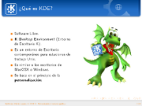
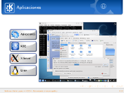
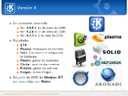

KDE 4 Reinventando el entorno gráfico
=====================================

Fecha: 2009-04-21 12:00
Categorías: KDE

  

Con motivo del [Festival Latinoamericano de Instalación de Software Libre, FLISOL 2009](http://www.gulag.org.mx/eventos/2009-04-25-flisol.html) he elaborado esta presentación sobre el origen y la nueva versión del [KDE](http://www.kde.org) llamándola *KDE 4 - Reinventando el entorno gráfico.*

Fuertes e innovadores cambios nos ofrece la versión 4 de este entorno de escritorio e infraestructura de desarrollo para sistemas Unix/Linux. Aunado a ello una gran comunidad de desarrolladores, traductores, diseñadores y promotores han incrementado sus esfuerzos para lograr crear lo mejor de lo mejor para el Software Libre.

Esta presentación está basada en los materiales de [Thomas Thym](http://ungethym.blogspot.com/2009/04/presenting-kde-at-linuxinfotag-in.html) y de [Arturo Hoffstadt](http://www.arturo.hoffstadt.cl/wp/2008/08/27/kde-4).

Una de las frases de la nueva campaña de KDE simboliza lo que les digo: _"Sé libre de pedir un deseo, y entonces ayuda a que se vuelva realidad"_.

#### Descargar

* [Presentación 8.7 MB](kde-4-reinventando-el-entorno-grafico/kde-4-reinventando-el-entorno-grafico.pdf)
* [Fuentes LaTeX 14.7 MB](kde-4-reinventando-el-entorno-grafico/kde-4-reinventando-el-entorno-grafico.tar.gz)
