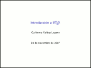
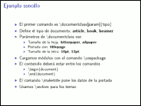

Introducción a LaTeX
====================

Fecha: 2007-11-12 13:00
Categorías: LaTeX

  

Como tema de la catorceava reunión del [Grupo de Usuarios de GNU/Linux de La Laguna](http://www.gulag.org.mx/) preparé esta sencilla introducción al [LaTeX](http://es.wikipedia.org/wiki/LaTeX). LaTeX es un lenguaje de marcado para documentos y un sistema de preparación de documentos, el cual es ampliamente usado en el sector científico y académico.

#### Descargar

* [Presentación](latex-introduccion/latex-introduccion.pdf)
* [Fuentes LaTeX de la presentación](latex-introduccion/latex-introduccion.tar.gz)
* [Ejemplo básico](latex-introduccion/ejemplo-0-primer/primer.pdf)
* [Ejemplo básico TeX](latex-introduccion/ejemplo-0-primer/primer.tex)
* [Artículo](latex-introduccion/ejemplo-1-sencillo/cms-de-ml-descripcion.pdf)
* [Artículo TeX](latex-introduccion/ejemplo-1-sencillo/cms-de-ml-descripcion.tex)
* [Artículo largo](latex-introduccion/ejemplo-2-articulo/licencia-gfdl.pdf)
* [Artículo largo TeX](latex-introduccion/ejemplo-2-articulo/licencia-gfdl.tex)
* [Libro](latex-introduccion/ejemplo-3-libro/via-pc2500-gentoo-lan-boot.pdf)
* [Libro LaTeX](latex-introduccion/ejemplo-3-libro/ejemplo-3-libro.tar.gz)
* [Descargar todo](latex-introduccion/latex-introduccion-presentacion-y-ejemplos.tar.gz)
