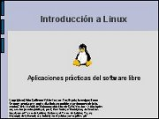
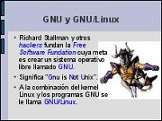
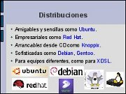

Introducción a GNU/Linux
========================

Fecha: 2007-04-01 14:00
Categorías: GNU/Linux

  

Plática introductoria al Software Libre, para explicar sus ventajas, conceptos utilizados y mostrar ejemplos de sus múltiples aplicaciones.

#### Descargar

* [Presentación](linux-introduccion/introduccion-linux.pdf)
