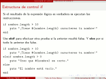

Taller de Ruby Básico
=====================

Fecha: 2009-11-22 23:55
Categorías: Ruby

  

Para el [Foro Académico Regional 2009](http://www.sistemasitl.com/foro2009/html/) en el [Instituto Tecnológico de la Laguna](http://www.itlalaguna.edu.mx/) su servidor impartió un Taller Básico de Ruby. Los asistentes conocieron y practicaron las bases de este relativamente nuevo lenguaje de programación que promete un gran futuro.

#### Descargar

* [Presentación 354 KB](ruby-basico-taller/taller-de-ruby-basico.pdf)
* [Fuentes LaTeX 5 KB](ruby-basico-taller/taller-de-ruby-basico.tar.gz)
