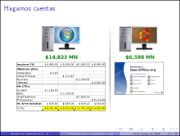
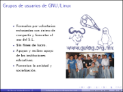

Software Libre en tiempos de crisis
===================================

Fecha: 2009-03-14 16:00
Categorías: GNU/Linux

  

No cabe duda que la crisis mundial, a pesar de los comentarios optimistas de nuestro gobierno, nos envuelve a todos y afecta la economía empresarial y familiar. Es este contexto, uno de los principales rubros donde buscamos reducción de costos es el de las Tecnologías de Información. He aquí una gran oportunidad para usar Software Libre, ya que si no podemos ahorrar en la compra y mantenimiento de hardware, sí lo podemos hacer al dejar de pagar el alto costo de las licencias privativas de software.

Punto aparte del ahorro económico, sabemos que el software es cada vez más el gran intermediario entre la información y la inteligencia humana. De la misma manera que nos preocupa la libertad para poder acceder a la información, nos debe preocupar con igual intensidad quién controla este intermediario y qué garantías tenemos de su transparencia y fiabilidad. El Software Libre, al dar acceso al código, es el único que puede garantizar esta transparencia.

#### Descargar

* [Presentación](software-libre-en-tiempos-de-crisis/software-libre-en-tiempos-de-crisis.pdf)
* [Fuentes LaTeX](software-libre-en-tiempos-de-crisis/software-libre-en-tiempos-de-crisis.tar.gz)
