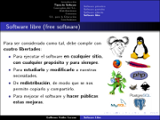
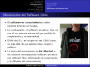
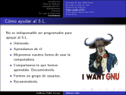

Software Libre
==============

Fecha: 2007-11-28 11:50
Categorías: GNU/Linux

  

Con el fin de extender el contenido de la presentación [Introducción a Linux](introduccion-linux.html) elaboré esta presentación bajo el título **Software Libre** que les servirá para explicar con más detalle los tipos de software, conceptos como GNU y GPL, mostrar algunas distribuciones e imágenes de varios entornos gráficos y algunos ejemplos de software libre para la educación.

#### Descargar
* [Presentación](software-libre/software-libre.pdf)
* [Fuentes LaTeX](presentacion-software-libre-fuentes.tar.gz)
