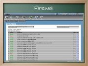

Webmin, administración y configuración desde web
================================================

Corto: Webmin
Fecha: 2007-05-11 09:00
Categorías: GNU/Linux

  

Breve presentación del Webmin, que es un paquete que permite la administración remota de equipos desde una interfaz web.

#### Descargar

* [Presentación](webmin/webmin.pdf)
